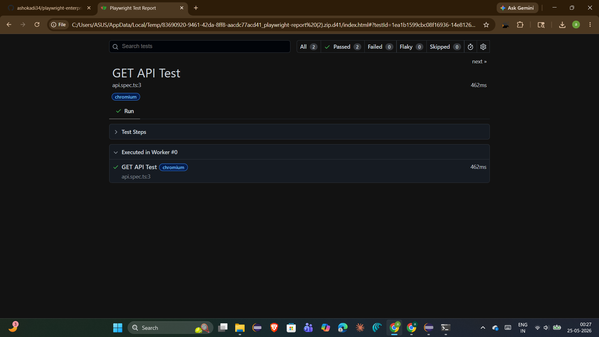
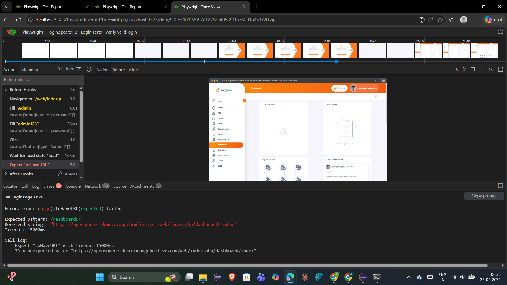
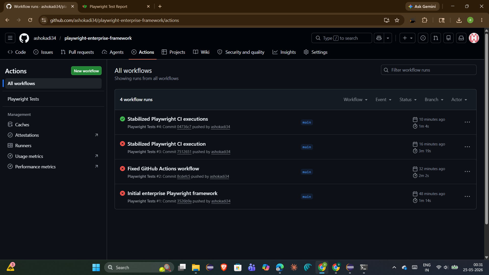
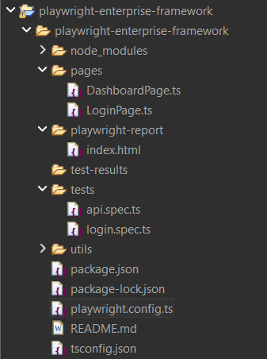

# Enterprise Playwright Automation Framework

A scalable test automation framework built with **Playwright and TypeScript** for UI and API testing, following enterprise-oriented automation practices such as Page Object Model, parallel execution, reporting, screenshots, traces, and CI/CD integration.

## Overview

This project demonstrates a modern **SDET / QA Automation framework** using Playwright with TypeScript.

The framework is designed to provide:

- UI test automation
- API test automation
- Page Object Model (POM)
- Parallel test execution
- Configurable test execution
- Automatic screenshots on failure
- Video recording on failure
- Playwright Trace Viewer support
- HTML test reporting
- GitHub Actions CI/CD integration
- Reusable utilities and framework components
- TypeScript-based maintainable test code

The project follows a clean separation between **tests, page objects, utilities, configuration, and CI/CD workflows**.

---

# Tech Stack

| Technology | Purpose |
|------------|---------|
| **TypeScript** | Test automation development |
| **Playwright** | UI and browser automation |
| **Playwright Test** | Test runner and assertions |
| **Node.js** | Runtime environment |
| **npm** | Dependency and script management |
| **GitHub Actions** | CI/CD automation |
| **HTML Report** | Test execution reporting |
| **dotenv** | Environment configuration |

---

## 🏗️ Framework Architecture

```text
                    ┌──────────────────────────┐
                    │      Test Scenarios      │
                    │     tests/*.spec.ts      │
                    └────────────┬─────────────┘
                                 │
                                 ▼
                    ┌──────────────────────────┐
                    │      Page Objects        │
                    │        pages/            │
                    └────────────┬─────────────┘
                                 │
                                 ▼
                    ┌──────────────────────────┐
                    │        Utilities         │
                    │         utils/           │
                    └────────────┬─────────────┘
                                 │
                                 ▼
                    ┌──────────────────────────┐
                    │    Playwright Engine     │
                    │   playwright.config.ts   │
                    └────────────┬─────────────┘
                                 │
                                 ▼
                    ┌──────────────────────────┐
                    │       Test Results       │
                    │ HTML / Screenshot / Trace│
                    └────────────┬─────────────┘
                                 │
                                 ▼
                    ┌──────────────────────────┐
                    │      GitHub Actions      │
                    │          CI/CD           │
                    └──────────────────────────┘
					
```
---	

# 📁 Project Structure

```text
playwright-enterprise-framework/
│
├── .github/
│   └── workflows/
│       └── ...
│
├── pages/
│   └── Page Object classes
│
├── tests/
│   └── Test specifications
│
├── utils/
│   └── Reusable framework utilities
│
├── screenshots/
│   └── Test execution screenshots
│
├── .gitignore
├── README.md
├── package.json
├── package-lock.json
├── playwright.config.ts
└── tsconfig.json
```
---

## Folder Responsibilities

>tests/ Contains Playwright test specifications and business-level test scenarios.

>pages/ Contains Page Object classes that encapsulate page locators and reusable page actions.

>utils/ Contains reusable helper and utility functions used across the framework.

>screenshots/ Contains screenshots associated with test execution.

>.github/workflows/ Contains GitHub Actions workflow configuration for CI execution.

playwright.config.ts/ Central Playwright configuration for:

>Test directory
Timeout configuration
Retries
Parallel execution
Browser project configuration
Screenshot handling
Video recording
Trace collection
HTML reporting

---

# Key Framework Features

1. Page Object Model

The framework follows the Page Object Model (POM) pattern.

Page-specific locators and actions are maintained separately from test scenarios.

This provides:

- Better code maintainability
- Reusable page actions
- Reduced locator duplication
- Cleaner test cases
- Easier application changes

Example structure:

```text
tests/
    login.spec.ts

pages/
    LoginPage.ts
```
> The test focuses on the business flow while the Page Object handles page interaction details.

2. UI Automation

Playwright is used to automate browser-based application workflows.

Typical automation flow:

```text
Test Scenario
      ↓
Page Object
      ↓
Locator / Action
      ↓
Browser
      ↓
Assertion
      ↓
Test Result
```
Playwright provides capabilities for:
```
Locators
Browser interaction
Assertions
Navigation
Auto-waiting
Screenshots
Video recording
Trace collection
```
3. API Automation

The framework also supports API automation using Playwright's API testing capabilities.

API automation can be used for validating:

HTTP status codes
Response payloads
API contracts
Request/response behavior
Backend workflows

A typical API validation flow:
```text
API Request
     ↓
Response
     ↓
Status Code Validation
     ↓
Response Payload Validation
     ↓
Test Result
```

4. Parallel Execution

The framework is configured for parallel test execution using Playwright Test.

Parallel execution helps reduce overall test execution time and makes the framework suitable for CI environments.

```text

                 Test Suite
                     │
          ┌──────────┼──────────┐
          ▼          ▼          ▼
        Test 1     Test 2     Test 3
          │          │          │
          └──────────┼──────────┘
                     ▼
                 Test Result
```
				 
5. Retry Mechanism

The Playwright configuration includes retry support for failed tests.

Retries can help identify tests that fail intermittently during execution, particularly in CI environments.

Retries should not be used to hide genuine application defects or unstable tests.

---

# 📊 Test Reporting

The framework uses the Playwright HTML reporter.

After execution, the report can be opened using:
```bash
npm run report
```
The HTML report provides information such as:
```
Test status
Execution duration
Test steps
Errors
Screenshots
Trace information when available
```
---

# 📸 Screenshots

Screenshots are configured to be captured when tests fail.

Configuration:
```TypeScript
use: {
    screenshot: 'only-on-failure'
}
```
This helps with debugging failed UI automation without generating unnecessary screenshots for every successful test.

# 🎥 Video Recording

Video recording is configured to be retained for failed tests.
```TypeScript
use: {
    video: 'retain-on-failure'
}
```
This provides additional debugging information when a test fails in CI or another non-interactive environment.

# 🔍 Trace Viewer

Playwright tracing is enabled for failed tests.
```TypeScript
use: {
    trace: 'retain-on-failure'
}
```
Trace files can help investigate:

Browser actions
Network activity
DOM snapshots
Screenshots
Test steps
Timing-related failures

Trace Viewer is particularly useful for debugging CI failures.

---

# ⚙️ Playwright Configuration

The central configuration is maintained in:
```text
playwright.config.ts
```
Important configuration areas include:
```TypeScript
testDir: './tests'
```
Defines the location of test specifications.
```TypeScript
timeout: 60000
```
Defines the maximum test execution timeout.
```TypeScript
fullyParallel: true
```
Enables parallel test execution.
```TypeScript
retries: 1
```
Configures retry behavior.
```TypeScript
reporter: [
    ['html']
]
```
Enables Playwright HTML reporting.

Failure diagnostics are configured using:
```TypeScript
use: {
    headless: true,
    screenshot: 'only-on-failure',
    video: 'retain-on-failure',
    trace: 'retain-on-failure'
}
```
---

# 🌐 Browser Configuration

The current framework configuration includes a Chromium project using Playwright's Desktop Chrome device configuration.
```TypeScript
projects: [
    {
        name: 'chromium',
        use: { ...devices['Desktop Chrome'] },
    }
]
```
Additional browser projects such as Firefox and WebKit can be added as the framework evolves.

---

# ▶️ Getting Started
Prerequisites

Install:

Node.js 18+
npm
Git

Verify the installation:
```bash
node --version
npm --version
```
---

## 📥 Clone Repository
```bash
git clone https://github.com/ashokadi34/playwright-enterprise-framework.git
```
Navigate to the project:
```bash
cd playwright-enterprise-framework
```
---

## 📦 Install Dependencies
```bash
npm install
```

## 🌐 Install Playwright Browsers
```bash
npx playwright install
```
---

# 🧪 Running Tests
Run all tests
```bash
npm test
```
Run tests in headed mode
```bash
npm run headed
```

This launches the browser UI during execution.

Run tests using Chromium
```bash
npm run chrome
```
Run tests using Firefox
```bash
npm run firefox
```
> Note: Firefox execution requires a corresponding Firefox project to be enabled in playwright.config.ts.

---

# 📊 Open HTML Report
```bash
npm run report
```
---

# 🔄 CI/CD with GitHub Actions

The framework includes GitHub Actions workflow configuration under:
```bash
.github/workflows/
```
The CI workflow is designed to execute automated tests consistently in a CI environment.
```text
Typical CI flow:

Developer Push
      ↓
GitHub Repository
      ↓
GitHub Actions
      ↓
Install Dependencies
      ↓
Install Playwright
      ↓
Execute Tests
      ↓
Generate Results
      ↓
Review Test Report
```
This enables automated validation whenever framework changes are pushed to the repository.

---

# 🧩 Test Execution Strategy

The framework can be used across multiple testing layers:
```text
                 Automation Framework
                         │
          ┌──────────────┴──────────────┐
          │                             │
          ▼                             ▼
      UI Testing                    API Testing
          │                             │
          └──────────────┬──────────────┘
                         ▼
                  End-to-End Flows
                         │
                         ▼
                    CI Pipeline
                         │
                         ▼
                     Reports
```
This approach allows UI and API validations to be maintained within the same Playwright-based automation ecosystem.

---


## Playwright HTML Report



---

## Trace Viewer



---

## GitHub Actions CI
GitHub Actions workflow integrated for automated execution.




---

## Framework Structure



---

# 💡 Why Playwright?

Playwright provides several capabilities that are useful for modern test automation:

Fast browser automation
Automatic waiting
Reliable locators
Built-in assertions
Parallel execution
API testing
Screenshots
Video recording
Trace Viewer
HTML reporting
CI/CD integration

The framework demonstrates how these capabilities can be organized into a maintainable automation architecture.

---

# 🧑‍💻 SDET Engineering Practices Demonstrated

This project demonstrates practical SDET concepts including:
```
Test automation architecture
Page Object Model
Reusable components
UI automation
API automation
Test isolation
Parallel execution
Retry strategy
Failure diagnostics
Test reporting
CI/CD integration
TypeScript-based automation development
Git-based version control
```
---

# 📈 Future Enhancements
Potential future improvements include:
```
Multi-browser execution with Firefox and WebKit
Docker-based execution
Allure reporting
Jenkins integration
Database validation
Visual regression testing
BrowserStack integration
Environment-specific configuration
Enhanced test data management
Advanced API test utilities
Improved CI artifact management
```

# Thank you!

